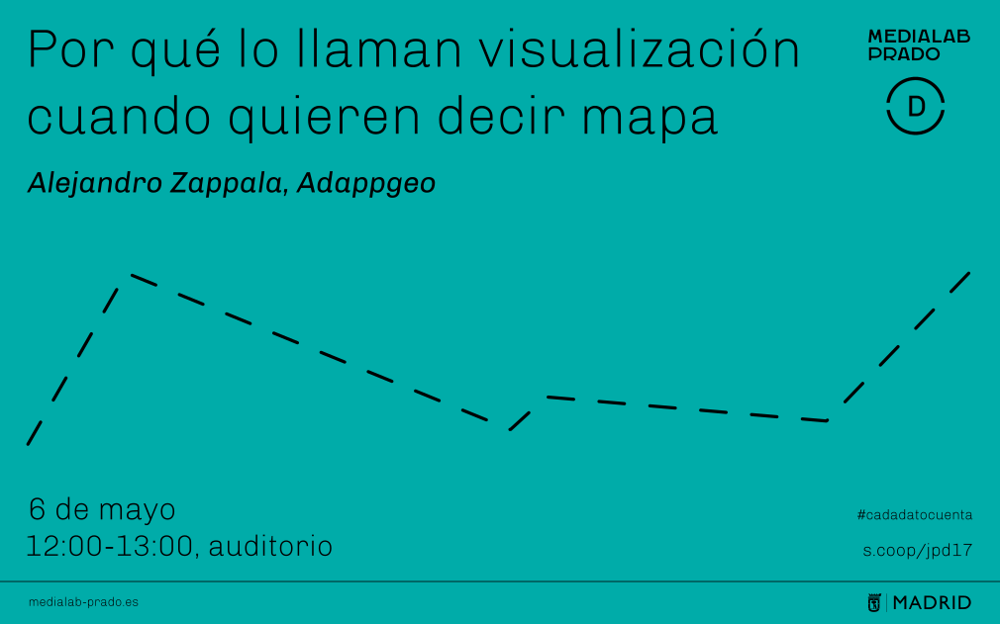

title: Diseño Cartográfico
class: animation-fade
layout: true

<!-- This slide will serve as the base layout for all your slides -->
.bottom-bar[
  {{title}}. Enlace al [video](https://www.youtube.com/watch?v=Anz-78hoBkQ&feature=youtu.be&t=2h23m34s)
]

---

---

class: center, middle

# {{title}}
## [Por qué lo llaman visualización cuando quieren decir mapa]

.footnote[Alejandro Zappala    [Jornadas de Periodismo de Datos 2017](http://medialab-prado.es/article/jornadas-de-periodismo-de-datos-2017-jpd17-cada-dato-cuenta)]
---
class: center
## Ideas Principales
--

- Contexto del formato final
--

- Sistemas de Información Geográfica (SIG)
--

- Infraestructuras de Datos Espaciales (IDE). INSPIRE
--

- Proyecciones Cartográficas
--

- Web Mapping
--

- Documentación
---

.left-column[
  ## Ideas Principales
  ### - Contexto
]
.right-column[
##Contexto
Ten en cuenta dónde se va a representar el mapa
- Noticia puntual vs Reportaje de fondo
- Entrada de Blog vs Web interactiva
- Impreso vs pantalla luminescente (donde cambian las reglas de color y de contraste)
- Si convive con otros formatos: Fotos, video, animaciones, histogramas, diagramas...
- Resoluciones y formatos
]

---
.left-column[
  ## Ideas Principales
  ### - Contexto
]
.right-column[
##Contexto
También es importante medir los recursos de que se dispone
- ¿Son datos dinámicos o estáticos?
- ¿Es imprescindible que un navegador o un servidor haga todo el proceso de filtrado y cálculo de datos cada vez que se entre en la web correspondiente, o puede ser una/varios mapas estáticos que alivien de carga los sistemas informáticos?
- Servidor con base de datos geográfica o documentos tabulados (JSON)
- Servicios de terceros, como [Carto](http://carto.com), [ESRI](http://esri.com), [Tableau](http://tableau.com), etc...
- Desarrollo web: HTML, CSS, Javascript, PHP...
]

???

Ojo con la disponibilidad y cambios de condiciones de los servicios a terceros a lo largo del tiempo
---
.left-column[
  ## Ideas Principales
  ### - Contexto
  ### - SIG
]

.right-column[

##Sistemas de Información Geográfica
- El software [SIG](https://volaya.github.io/libro-sig/chapters/Introduccion_fundamentos.html) es una herramienta óptima de análisis para trabajar con datos con componente geográfica.

- Herramienta de edición, análisis y visualización de datos

- La limpieza y estructuración de los datos debería ser enfocada a los formatos SIG

- Asegurando la salida de datos en formatos de estándares abiertos [OGC](http://www.opengeospatial.org/)

- Más de [50 años de desarrollo](https://volaya.github.io/libro-sig/chapters/Historia.html), con [opciones FOSS](http://www.osgeo.org/) desde 1985
]

---
.left-column[
  ## Ideas Principales
  ### - Contexto
  ### - SIG
]

.right-column[

##Sistemas de Información Geográfica
[Formatos](http://gisgeography.com/spatial-data-types-vector-raster/)
- ráster
- vectorial: entidades geográficas + atributos
]

---
.left-column[
  ## Ideas Principales
  ### - Contexto
  ### - SIG
]

.right-column[

##Análisis SIG
- JOIN entre capas (código INE)
- Georeferenciación de imágenes --> Digitalización vectorial
- Cálculo de redes
- Calculadora de campos
]

---
.left-column[
  ## Ideas Principales
  ### - Contexto
  ### - SIG
]

.right-column[

##Entorno Layout
Exportación a cualquier formato que necesitemos

- imagen ráster: PNG, JPEG,
- imagen vectorial: SVG
- documentos PDF
- documentos geoJSON: Para web mapping, por ejemplo
- KML, GML...
]

---
.left-column[
  ## Ideas Principales
  ### - Contexto
  ### - SIG
  ### - Diseño Cartográfico
]

.right-column[

##Diseño Cartográfico
Cuando hablamos de diseño nos referimos a que se siguen unas normas, de legibilidad, de usabilidad...

- Es importante conocer las [bases de simbolización cartográfica](http://geografiafisica.org/sem_2015_01/maestria_geom/SIG_p_GdR/elementos_diseno_cartografico/pdf_08_la_simbolizacion.pdf). Las variables del diseño cartográfico ya están definidas y corroboradas (color, forma, tamaño, contraste, generalización de formas)
- La misión del mapa es la de `facilitar la lectura y categorizar visualmente` la información georeferenciada
- Simbolización y simplificación
- Desde luego, un 30% de creatividad
]

---
.left-column[
  ## Ideas Principales
  ### - Contexto
  ### - SIG
  ### - Diseño Cartográfico
  ### - IDE
]
.right-column[
##Infraestructuras de Datos Espaciales
Datos geográficos oficiales en formatos abiertos normalizados

- Existe una [IDEE](https://www.europeandataportal.eu/) con una evolución de más de 20 años donde encontrar toda la información oficial abierta disponible en el contexto europeo
- Los datos geográficos oficiales se encuentran en el [geoportal del CNIG](http://centrodedescargas.cnig.es/CentroDescargas/index.jsp)
- Vienen de la Directiva europea [INSPIRE](http://inspire.ec.europa.eu/inspire-your-country-map/27543)
]
---
.left-column[
  ## Ideas Principales
  ### - Contexto
  ### - SIG
  ### - Diseño Cartográfico
  ### - IDE
  ### - Proyecciones Cartográficas
]
.right-column[
##Proyecciones Cartogŕaficas
Ten siempre presente el [sistema de referencia](http://www.ideandalucia.es/portal/iderap-portlet/content/300e9cf2-5fa1-471a-9885-26f36f68b9b7) de los datos que obtienes, así como de los datos que vas a representar.
Las [proyecciones cartográficas](https://es.wikipedia.org/wiki/Proyecci%C3%B3n_cartogr%C3%A1fica):
- No son un adorno
- Tienen propiedades y limitaciones
- Siempre encontrarás la que necesitas
]

???

No es preciso conocer el proceso matemático que las ha generado para usarlas debidamente, al igual que para conducir un automóvil no es necesario dominar su mecánica. Al usuario de datos geográficos le basta con saber que las proyecciones existen, que no son un adorno, que tienen propiedades y limitaciones, y que siempre podrán encontrar la más apropiada, con la seguridad de que la que precisan ya está inventada, porque hay muchas donde elegir - José Martín López
---

.left-column[
  ## Ideas Principales
  ### - Contexto
  ### - SIG
  ### - Diseño Cartográfico
  ### - IDE
  ### - Proyecciones Cartográficas
]
.right-column[
##Proyecciones Cartogŕaficas

- Sistema Geodésico de Referencia (SGR): Elipsoide + Datum --> Proyección
- Codificación [EPSG](http://www.epsg.org/)
]
---
.left-column[
  ## Ideas Principales
  ### - Contexto
  ### - SIG
  ### - Diseño Cartográfico
  ### - IDE
  ### - Proyecciones Cartográficas
]
.right-column[
##Proyecciones Cartogŕaficas

Una proyección solo puede tener, como máximo una de estas propiedades:
- conforme: Conserva los ángulos
- equivalente: Conserva las superficies
- equidistante: Conserva las distancias
]

---

.left-column[
  ## Ideas Principales
  ### - Contexto
  ### - SIG
  ### - Diseño Cartográfico
  ### - IDE
  ### - Proyecciones Cartográficas
]
.right-column[
##Sistema Geodésico Oficial en España
`(1852-1970)` Sistema de Referencia local
- Elipsoide de referencia de Struve
- Datum: Madrid
- Proyección poliédrica
]

---

.left-column[
  ## Ideas Principales
  ### - Contexto
  ### - SIG
  ### - Diseño Cartográfico
  ### - IDE
  ### - Proyecciones Cartográficas
]
.right-column[
##Sistema Geodésico Oficial en España
`(1970-2007)` Sistema Geodésico de Referencia ED50 (regional)
- Elipsoide internacional, de 1924. (Elipsoide de Hayford, 1909)
- Se toma el origen de latitudes el Ecuador, como origen de longitudes el meridiano de Greenwich y como Punto Astronómico Fundamental o Datum Fundamental, la torre de Helmert, en Postdam (entonces Alemania del Este)
- Proyección Universal Transversal Mercator (UTM)
- `EPSG 4230`, para coordenadas geográficas.
- `EPSG 230xx`, para UTM, donde “xx” es el huso correspondiente.
]

???
Tras la Segunda Guerra Mundial, el Coast and Geodetic Survey de los EEUU realizó una compensación de redes geodésicas de los países aliados con el fin de obtener una cartografía unificada, definiendo el Sistema Geodésico de Referencia ED50 ó European Datum 1950.
---

.left-column[
  ## Ideas Principales
  ### - Contexto
  ### - SIG
  ### - Diseño Cartográfico
  ### - IDE
  ### - Proyecciones Cartográficas
]
.right-column[
##Sistema Geodésico Oficial en España
`(2015-Act)` European Terrestrial Reference System 89 (ETRS89)
- Elipsoide GRS80 (Geodetic Reference System 1980)
- Se toma el origen de latitudes el Ecuador, como origen de longitudes el meridiano de Greenwich y como Punto Astronómico Fundamental o Datum Fundamental, la torre de Helmert, en Postdam (entonces Alemania del Este)
- Proyección Universal Transversal Mercator (UTM)
- `EPSG 4258`, para coordenadas geográficas.
- `EPSG 258xx`, para UTM, donde “xx” es el huso correspondiente.
]

---

.left-column[
  ## Ideas Principales
  ### - Contexto
  ### - SIG
  ### - Diseño Cartográfico
  ### - IDE
  ### - Proyecciones Cartográficas
]
.right-column[
##Sistema Geodésico Oficial en España
`(2015-Act)` European Terrestrial Reference System 89 (ETRS89)
- Para cartografía terrestre, básica y derivada, a escala igual o menor de 1:500.000, se adopta el sistema de referencia de coordenadas ETRS-Cónica Conforme de Lambert.
]

---
.left-column[
  ## Ideas Principales
  ### - Contexto
  ### - SIG
  ### - Diseño Cartográfico
  ### - IDE
  ### - Proyecciones Cartográficas
]
.right-column[
##Sistema Geodésico Oficial en España
[Hasta el 1 de enero de 2015](https://www.boe.es/boe/dias/2007/08/29/pdfs/A35986-35989.pdf) la información geográfica y cartográfica podía compilarse y publicarse en cualquiera de los dos sistemas de referencia ED50 o ETRS89, conforme a las necesidades de cada Administración Pública, siempre que las producciones en ED50 contengan la referencia a ETRS89. A partir del 1 de enero de 2015, únicamente puede utilizarse el sistema de referencia ETRS89.
]

---
.left-column[
  ## Ideas Principales
  ### - Contexto
  ### - SIG
  ### - Diseño Cartográfico
  ### - IDE
  ### - Proyecciones Cartográficas
]
.right-column[
##Sistema de referencia para web mapping

- Sistema de referencia [WGS84](https://epsg.io/4326)
- EPSG: 4326
- Viene de su uso por GPS
]

---
.left-column[
  ## Ideas Principales
  ### - Contexto
  ### - SIG
  ### - Diseño Cartográfico
  ### - IDE
  ### - Proyecciones Cartográficas
  ### - Web Mapping
]
.right-column[
##Web Mapping
- Mide tus fuerzas: Miniweb interactiva VS Buen diseño (carto)gráfico estático
- Es importante conocer las [bases de simbolización cartográfica](http://geografiafisica.org/sem_2015_01/maestria_geom/SIG_p_GdR/elementos_diseno_cartografico/pdf_08_la_simbolizacion.pdf)
- No hace falta inventar la rueda: Las variables del diseño cartográfico ya están definidas y corroboradas (color, forma, tamaño, contraste, generalización de formas, etc.), según el tipo de dato que queramos dar (variables continuas, discretas...)
]
---
.left-column[
  ## Ideas Principales
  ### - Contexto
  ### - SIG
  ### - Diseño Cartográfico
  ### - IDE
  ### - Proyecciones Cartográficas
  ### - Web Mapping
]
.right-column[
##Visualizadores cartográficos

- Visualizador: [Openlayers](http://openlayers.org/), [Leaflet](http://leafletjs.com/)...
- Mapa base: [OpenStreetMap](http:/openstreetmap.org), [Google Maps](http://google.es/maps), servicios WMS como el del [PNOA](http://blog-idee.blogspot.com.es/2014/09/nuevo-servicio-wms-de-ortofotos-del-ign.html), ...
- Datos: Los datos que se quieren representar
]
---

.left-column[
  ## Ideas Principales
  ### - Contexto
  ### - SIG
  ### - Diseño Cartográfico
  ### - IDE
  ### - Proyecciones Cartográficas
  ### - Web Mapping
  ### - Documentación
]
.right-column[
##Documentación
Un proyecto de análisis de datos ha de estar [perfectamente documentado](https://github.com/rdpeng/courses/blob/master/05_ReproducibleResearch/Checklist/index.md) para poder ser contrastado

- Indica siempre el origen de las fuentes de datos, así como su fecha
- Cuantos más detalles mejor (metodología de captura de datos, formato de los datos obtenidos...)
- Documenta los procesos de análisis como para poder repetirlos y obtener los mismos resultados
- Utiliza un sistema de control de versiones durante todo el proceso (git, por ejemplo)
]
---
.left-column[
  ## Ideas Principales
  ### - Contexto
  ### - SIG
  ### - Diseño Cartográfico
  ### - IDE
  ### - Proyecciones Cartográficas
  ### - Web Mapping
  ### - Documentación
  ### - Bibliografía
]
.right-column[
##Bibliografía - General
- [Sistemas de Información Geográfica - Víctor Olaya](https://volaya.github.io/libro-sig/)
- [How to Lie with Maps - Mark S. Monmonier](http://www.markmonmonier.com/how_to_lie_with_maps_14880.htm)
- [Conceptos Cartográficos - IGN](http://www.ign.es/web/resources/cartografiaEnsenanza/conceptosCarto/concepCarto_18.html)
- [La verdad sobre el mapa de Peters - naukas.com](http://naukas.com/2012/05/07/el-mapa-de-peters/)
- [Historia de la cartografía y la topografía - José Martín López]()
- [El Cartógrafo - Dramaturgia y dirección de Juan Mayorga](https://www.youtube.com/watch?v=WdNSl8F5xIw)
]
---
.left-column[
  ## Ideas Principales
  ### - Contexto
  ### - SIG
  ### - Diseño Cartográfico
  ### - IDE
  ### - Proyecciones Cartográficas
  ### - Web Mapping
  ### - Documentación
  ### - Bibliografía
]
.right-column[
##Bibliografía - Tutoriales SIG
- [Manuales y tutoriales de QGis](http://docs.qgis.org/2.14/en/docs/index.html)
- [Use the Five-Step GIS Analysis Process - Esri Training Matters](https://blogs.esri.com/esri/esritrainingmatters/2009/10/08/use-the-five-step-gis-analysis-process/)
- [Tutorial Layout QGis - Tim Sinnott](http://vcgi.vermont.gov/sites/vcgi/files/event_archive/sinnott_QGIS_Cartography.pdf)
- [Tutorial para Georeferenciar una imagen con QGIS](http://docs.qgis.org/1.8/en/docs/user_manual/plugins/plugins_georeferencer.html)
]
---

.left-column[
  ## Ideas Principales
  ### - Contexto
  ### - SIG
  ### - Diseño Cartográfico
  ### - IDE
  ### - Proyecciones Cartográficas
  ### - Web Mapping
  ### - Documentación
  ### - Bibliografía
]
.right-column[
##Bibliografía - Diseño Cartográfico
- [Fundamentos del diseño cartográfico - Miguel Ángel Bernabé](http://geografiafisica.org/sem_2015_01/maestria_geom/SIG_p_GdR/elementos_diseno_cartografico/pdf_08_la_simbolizacion.pdf)
- [Cartographic Design Principles - Ordnance Survey](https://www.ordnancesurvey.co.uk/resources/carto-design/carto-design-principles.html)
- [Principles of cartographic design - gislounge.com](https://www.gislounge.com/principles-of-cartographic-design/)

]
---

class: center, middle

##Gracias por vuestra atención

- Slideshow created using [remark](http://github.com/gnab/remark)
.footnote[Alejandro Zappala [@alayzappala](https://twitter.com/alayzappala)]

